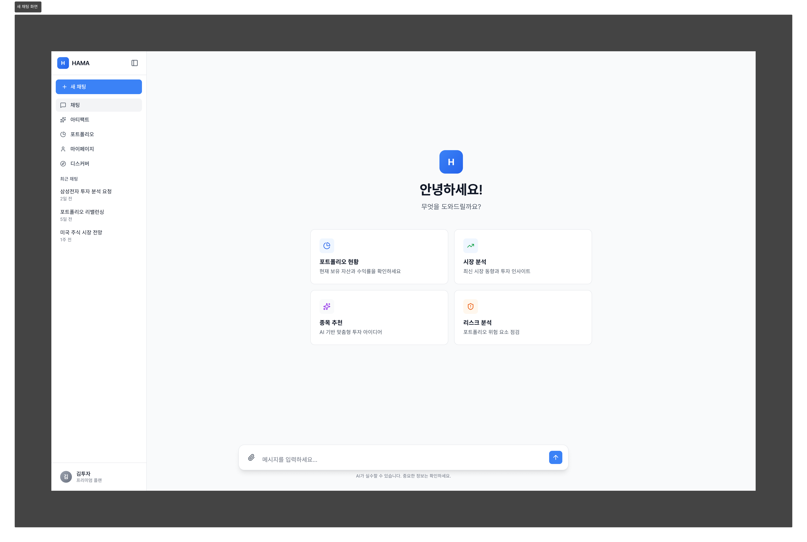
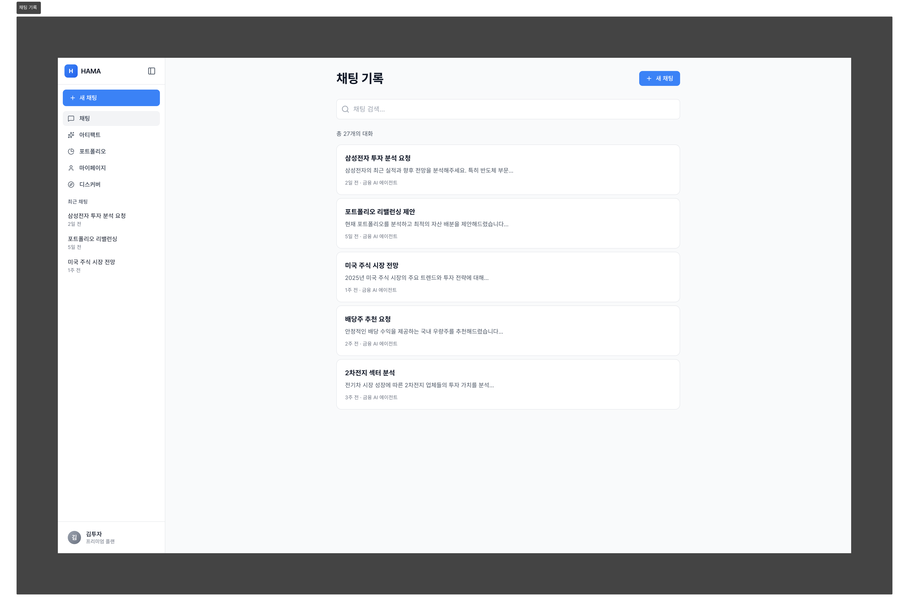
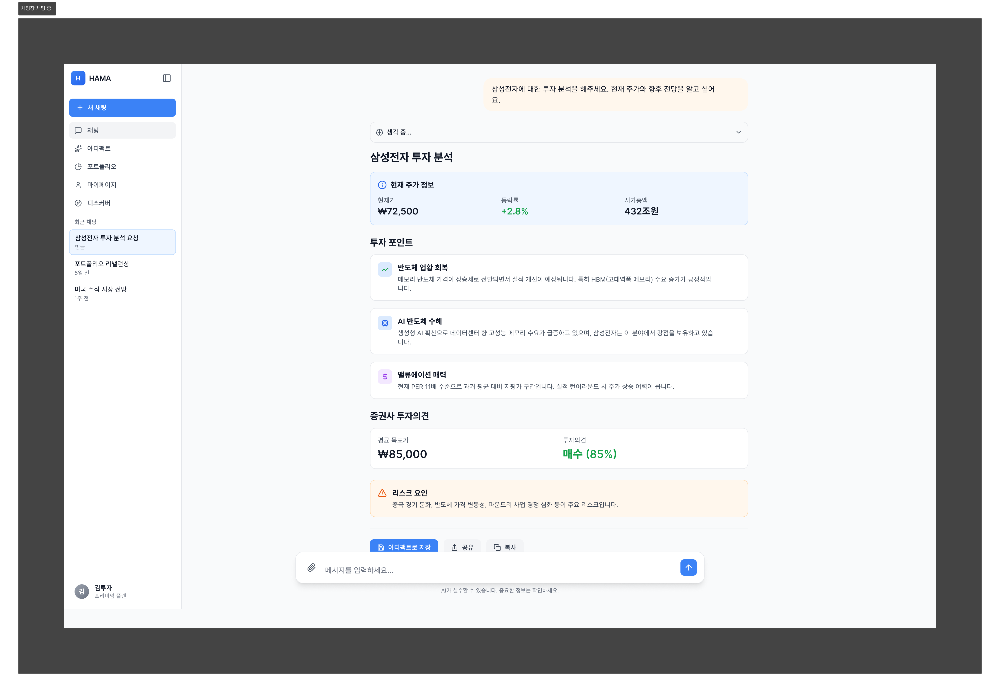
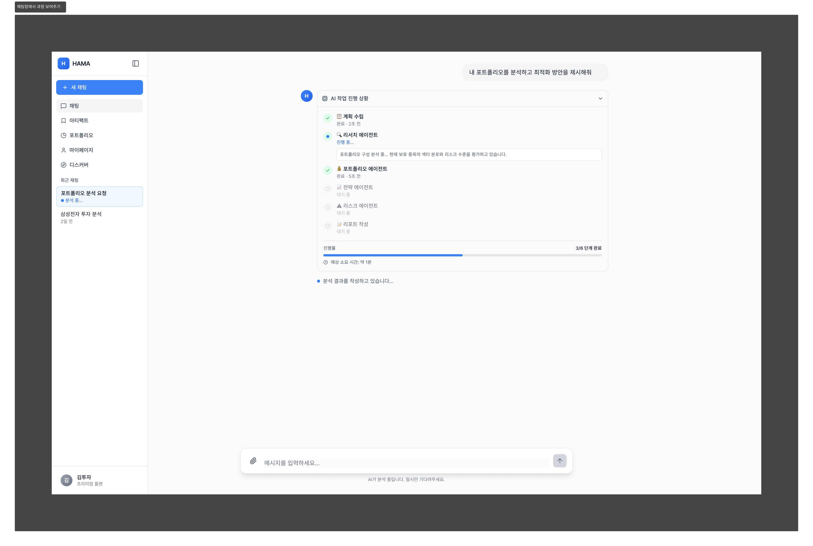
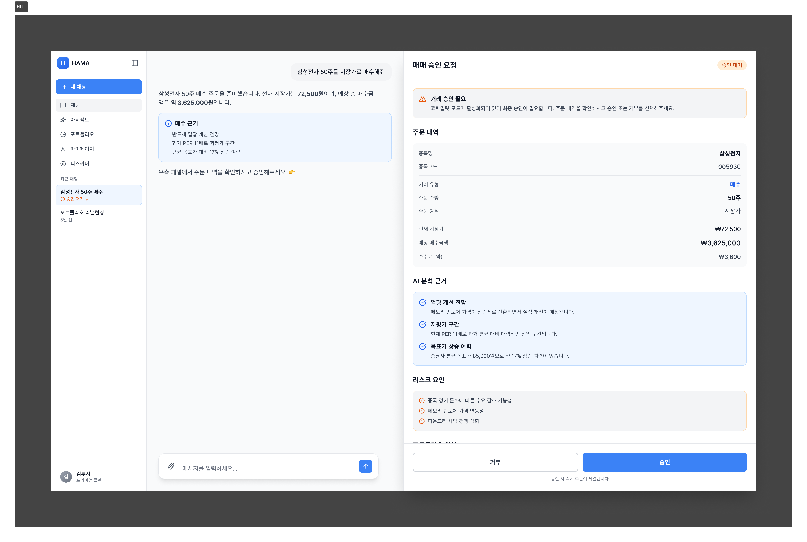
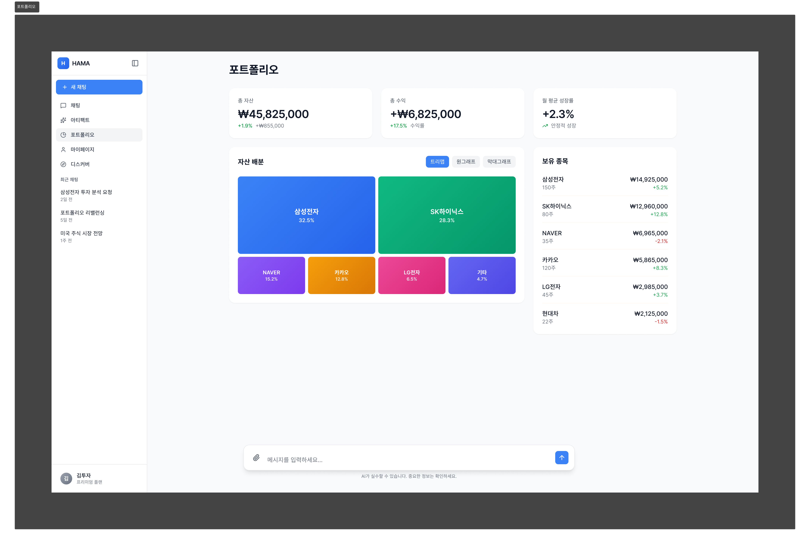
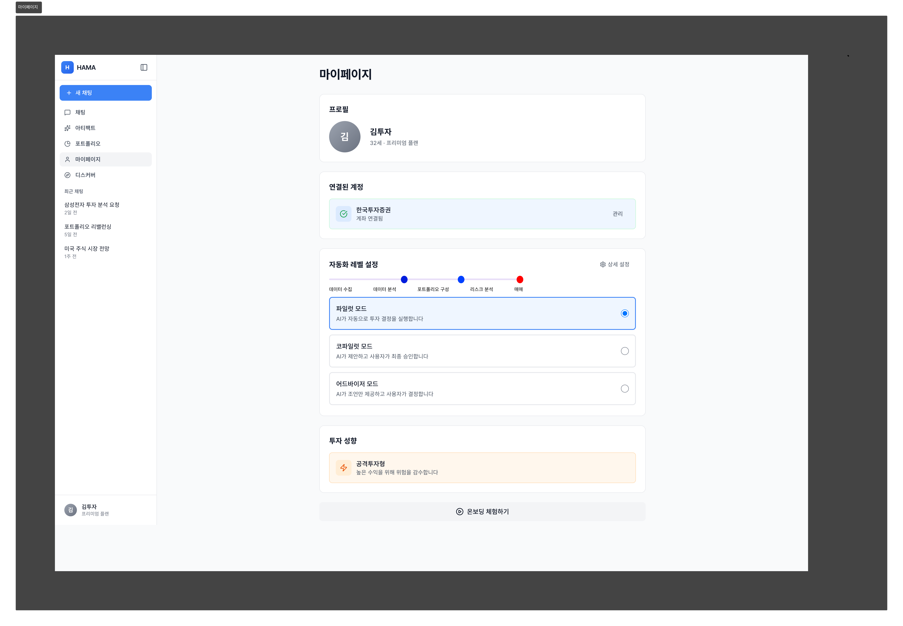
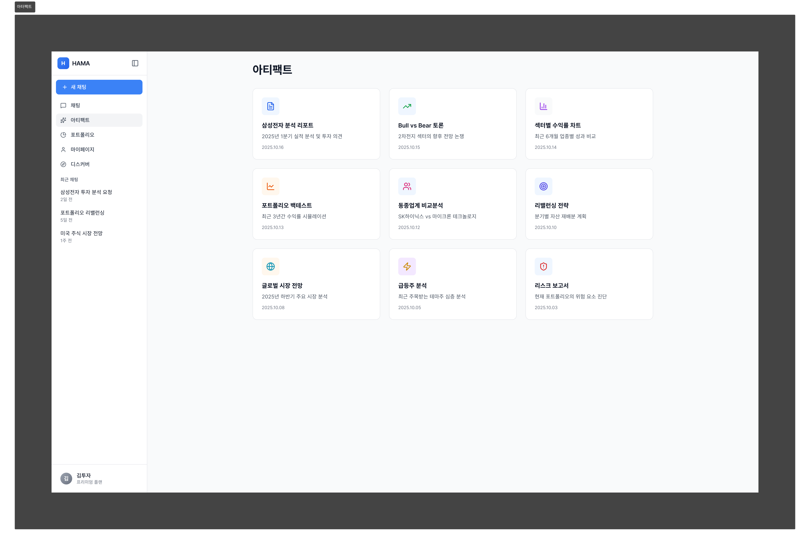
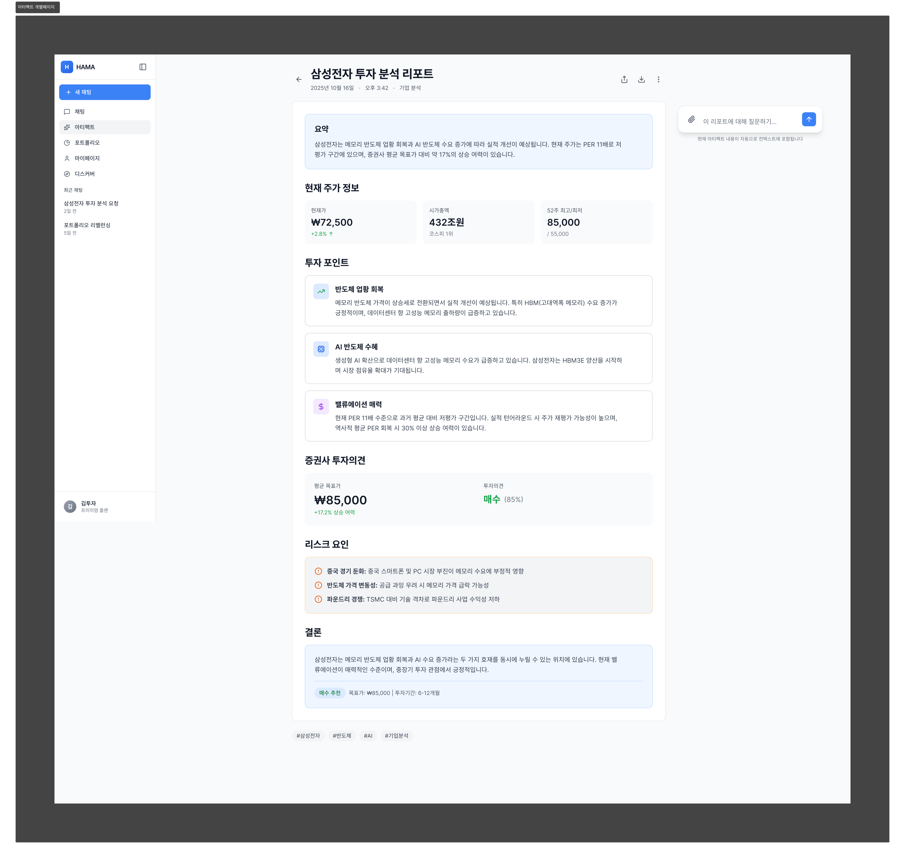
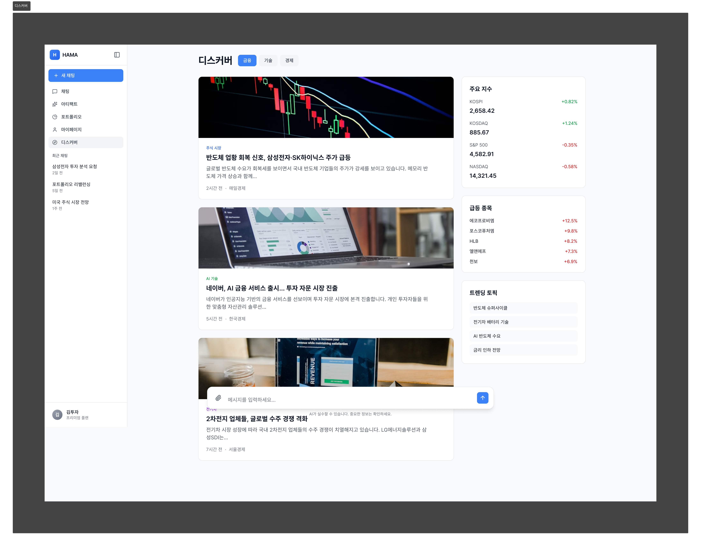

# HAMA Frontend - Product Requirements Document (PRD)

**Version:** 2.0
**Last Updated:** 2025-10-20
**Status:** MVP Development
**Purpose:** 캡스톤 프로젝트 발표회 부스 시연용 웹 클라이언트

---

## 📚 Reference Documents

### Required Reading
- **BackendPRD.md** (`references/`) - Backend 기능 요구사항, HITL 플로우, 자동화 레벨 시스템
- **backendAPI.md** (`references/`) - API 엔드포인트 명세 및 Request/Response 스키마
- **초기스크리닝.md** (`references/`) - 온보딩 플로우 및 질문 시나리오
- **design지시.md** (`references/`) - UI/UX 디자인 시스템 및 스타일 가이드
- **HAMA Front IA.png** (`references/`) - 정보 구조(IA) 다이어그램
- **TechnicalSpecification.md** (`docs/`) - 개발 구현 상세 명세 (본 문서와 분리)

### HTML/PNG Prototypes

**참조 위치:**
- HTML: `references/html_references/`
- PNG (최신): `references/mockup_references/`
- UI/UX 참조 이미지: `references/img_references/`

**프로토타입 목록:**
1. **시작 제안 카드뷰** - 대화 없을 때 초기 화면
2. **대화 기록 뷰** - 대화 시작 후 메시지 표시
3. **AI 생각 과정 뷰** - 채팅 내 토글 기능 (LangGraph Activity)
4. **Chat History** - 지난 대화 목록 뷰
5. **HITL 승인 패널** - 승인/거부 인터페이스
6. **아티팩트 목록 그리드 뷰** - Artifacts 목록 페이지
7. **아티팩트 본문 뷰** - Artifact 상세 뷰
8. **Portfolio** - 포트폴리오 대시보드
9. **My Page** - 마이페이지/설정
10. **Discover** - 뉴스 피드

**중요:** PNG가 최신 버전입니다. HTML과 차이가 있는 경우:
- Chat History, 아티팩트 목록 그리드 뷰: 하단 프롬프트바 제거됨
- 아티팩트 본문 뷰: 하단 프롬프트바를 옆으로 이동
- My Page: 하단 프롬프트바 제거, 자동화 레벨 설정에 프로그레스바 추가

---

## 1. Executive Summary

### 1.1 제품 개요

HAMA Frontend는 **Human-in-the-Loop AI 투자 시스템**을 위한 웹 클라이언트입니다.
사용자는 AI와 대화하며 투자 의사결정을 내리고, 중요한 순간(매매 등)에는 반드시 승인 과정을 거칩니다.

**핵심 가치:**
- 사용자가 AI와 **자연스럽게 대화하며** 투자 정보를 얻을 수 있어야 합니다
- AI의 매매 제안을 **반드시 확인하고 승인**할 수 있어야 합니다 (Human-in-the-Loop)
- 복잡한 투자 분석 결과를 **직관적으로 시각화**하여 이해할 수 있어야 합니다
- **캡스톤 발표회 부스 방문객**에게 HITL 시스템을 효과적으로 시연할 수 있어야 합니다

### 1.2 핵심 설계 원칙

1. **Chat First**: 모든 주요 기능이 Chat 인터페이스를 통해 접근 가능해야 합니다
2. **Persistent Chat Input**: Chat, Artifact 상세, Portfolio 화면에서 Chat 입력창이 하단에 고정되어야 합니다
3. **HITL 필수 표시**: 승인이 필요한 경우 반드시 화면에 표시되고, 사용자가 결정을 내릴 때까지 닫히지 않아야 합니다
4. **에이전트 활동 통합 표시**: LangGraph 에이전트 활동은 Chat 화면 내에 Claude처럼 시간 순서대로 자연스럽게 표시되어야 합니다
5. **다크 모드 초기 설계**: CSS 구조부터 Light/Dark 모드를 고려하여 설계해야 합니다

### 1.3 시연 시나리오 (Demo Context)

발표회 부스 방문객은 다음과 같은 플로우를 경험해야 합니다:
1. **온보딩 체험** (선택): 투자 성향 파악 (2분)
2. **메인 Chat**: AI와 대화하며 종목 분석 요청 (3분)
3. **HITL 승인**: AI가 제안한 매매를 검토하고 승인/거부 (1분)
4. **포트폴리오 확인**: 시각화된 포트폴리오 확인 (1분)

**총 시연 시간: 약 5-7분**

---

## 2. Design System & References

### 2.1 UI/UX 참조

참조 이미지: `references/img_references/`

| 요소 | 참조 대상 | 적용 범위 |
|------|---------|---------|
| **Shell & LNB** | Claude | 좌측 사이드바 구조, 토글 방식 |
| **Chat Interface** | Gemini | 사용자 질문(말풍선), AI 답변(전체 너비) |
| **Portfolio** | PilePeak.ai | 레이아웃, 차트 톤앤매너, Light Mode 색상 |
| **전체 테마** | PilePeak.ai Light Mode | 흰색 배경, 회색/검은색 텍스트 |

### 2.2 기술 스택

- **Framework**: Next.js (React)
- **Styling**: Tailwind CSS (dark mode 지원)
- **Icons**: Lucide React (strokeWidth: 1.5)
- **상태관리**: React Context / Zustand
- **HTTP Client**: Axios / Fetch
- **Markdown**: react-markdown
- **차트**: Chart.js 또는 Recharts
- **i18n**: react-i18next (다국어 지원)

### 2.3 Typography

- 제목 (>20px): `tracking-tight` 적용
- 본문: 적절한 line-height로 가독성 확보
- Bold 대신 **Semibold** 사용 (한 단계 얇게)

---

## Phase 1: 시연 필수 코어

*이것 없이는 데모가 성립되지 않는 기능 + 초기 설계부터 반영해야 하는 기능*

---

## FR-1. Core Layout (전체 레이아웃)

**참조 이미지:**




### FR-1.1 Global Shell

**요구사항:**
사용자는 모든 페이지에서 일관된 레이아웃을 경험해야 합니다.

**기능:**
- 좌측 내비게이션 바(LNB)를 통해 주요 페이지로 이동할 수 있어야 합니다
- LNB를 토글(접기/펼치기)하여 화면 공간을 조절할 수 있어야 합니다
- Chat, Artifact 상세, Portfolio 페이지에서 하단 Chat 입력창이 항상 고정되어야 합니다

**Why (필요성):**
- 발표회 시연 시 빠르게 페이지 간 전환이 가능해야 합니다
- 어느 화면에서든 즉시 AI에게 질문할 수 있어야 합니다 (Chat First 원칙)

**UX States:**
- LNB 펼침 상태 (260px)
- LNB 접힘 상태 (0px)
- 상태는 LocalStorage에 저장되어 다음 방문 시에도 유지되어야 합니다

**예외 처리:**
- LocalStorage 저장 실패 시: 기본값(펼침)으로 동작

---

### FR-1.2 Left Navigation Bar (LNB)

**요구사항:**
사용자는 LNB를 통해 주요 기능에 빠르게 접근하고, 최근 채팅 내역을 확인할 수 있어야 합니다.

**기능:**
- 다음 메뉴로 이동할 수 있어야 합니다:
  1. 채팅 (Active Chat - 기본 화면)
  2. Artifacts (저장된 분석 결과) - Phase 3
  3. 포트폴리오 - Phase 2
  4. 마이페이지 - Phase 2
  5. 디스커버 (뉴스 피드) - Phase 4
- 최근 채팅 목록(최대 10개)을 확인하고 클릭하여 해당 채팅으로 이동할 수 있어야 합니다
- 현재 활성 채팅은 시각적으로 강조되어야 합니다
- HITL 승인 대기 중인 채팅은 뱃지로 표시되어야 합니다

**Why:**
- 시연 중 여러 시나리오를 빠르게 전환해야 합니다
- 방문객이 이전 대화 내용을 쉽게 확인할 수 있어야 합니다

**Empty State:**
- 최근 채팅이 없을 경우: "채팅 기록이 없습니다" + "새 채팅" 버튼 강조

---

### FR-1.3 Persistent Chat Input

**요구사항:**
사용자는 Chat, Artifact 상세, Portfolio 화면에서 언제든지 AI에게 질문할 수 있어야 합니다.

**기능:**
- 화면 하단 중앙에 Chat 입력창이 고정되어야 합니다 (Perplexity 스타일)
- 입력창에서 텍스트를 입력하고 Enter로 전송할 수 있어야 합니다
- Shift+Enter로 줄바꿈할 수 있어야 합니다
- 전송 버튼을 클릭하여 메시지를 보낼 수 있어야 합니다

**Input Validation:**
- 최소 1자 이상 입력해야 전송 가능해야 합니다
- 공백만 입력된 경우 전송 버튼이 비활성화되어야 합니다
- 최대 5000자까지 입력 가능하며, 초과 시 경고 메시지가 표시되어야 합니다
- 4900자 이상일 때 글자 수 표시: "4952 / 5000"

**Why:**
- Chat First 원칙: 어느 화면에서든 즉시 대화를 이어갈 수 있어야 합니다
- 시연 시 매끄러운 사용자 경험을 제공해야 합니다

**예외 처리:**
- 입력 중 페이지 이탈 시: "입력한 내용이 저장되지 않을 수 있습니다" 경고창
- SessionStorage에 임시 저장 (5분간 유지)
- 재진입 시 복원 제안: "이전에 입력한 내용을 복원하시겠습니까?"

---

## FR-2. Chat Interface (대화 인터페이스)

**참조 이미지:**




### FR-2.1 메시지 표시

**요구사항:**
사용자는 AI와의 대화 내역을 명확하게 확인할 수 있어야 합니다.

**기능:**
- 사용자 메시지는 말풍선 형태로 표시되어야 합니다 (Gemini 스타일)
- AI 답변은 전체 너비를 활용하여 표시되어야 합니다
- AI 답변은 Markdown 형식을 지원해야 합니다:
  - 헤딩 (h1-h6)
  - 리스트 (ul, ol)
  - 테이블
  - 코드 블록
  - 인라인 코드
  - 링크 (외부 링크는 `rel="noopener noreferrer"` 추가)
  - 이미지
  - 볼드/이탤릭
- 메시지 전송 중에는 로딩 스피너가 표시되어야 합니다
- AI 응답 대기 중에는 "생각하는 중..." 애니메이션이 표시되어야 합니다 (점 3개 깜빡임)

**Why:**
- 복잡한 투자 분석 결과를 읽기 쉽게 표시해야 합니다
- 시연 시 방문객이 AI의 추론 과정을 이해할 수 있어야 합니다

**Loading States:**
- 사용자 메시지: 즉시 화면에 표시 (낙관적 업데이트) + 작은 로딩 스피너
- Chat Input 비활성화 (전송 중복 방지)

**Error States:**
- 메시지 전송 실패 시:
  - 메시지 옆에 ⚠️ 아이콘
  - 연한 빨간색 배경
  - "전송 실패" + "재전송" 버튼
  - "재전송" 또는 "삭제" 옵션 제공

---

### FR-2.2 에이전트 활동 표시 (LangGraph Thinking)

**요구사항:**
사용자는 AI가 현재 무엇을 하고 있는지 실시간으로 확인할 수 있어야 합니다.

**기능:**
- AI의 추론 과정(Thinking)이 Chat 메시지 내에 Claude처럼 시간 순서대로 표시되어야 합니다
- Thinking 섹션은 기본적으로 접혀 있어야 하며, 클릭하면 펼쳐져야 합니다
- 에이전트가 실행하는 단계가 표시되어야 합니다:
  - `planner` → "📋 계획 수립 중..."
  - `researcher` → "🔍 데이터 수집 중..."
  - `strategy` → "💡 전략 분석 중..."
- 실시간 스트리밍이 지원되어야 합니다 (SSE 또는 폴링)

**Why:**
- 발표회 시연 시 AI의 작동 과정을 투명하게 보여줘야 합니다
- HITL 시스템의 신뢰성을 입증하는 데 중요합니다

**예외 처리:**
- SSE 연결 실패 시:
  - 3회 재시도 (지수 백오프: 1s, 2s, 4s)
  - 3회 실패 후: "실시간 업데이트를 사용할 수 없습니다" 경고
  - 일반 폴링 모드(5초 간격)로 전환
- 연결 상태 UI 표시:
  - 연결됨: 초록색 점 + "실시간 연결됨"
  - 연결 중: 노란색 점 + "연결 중..."
  - 연결 끊김: 회색 점 + "연결 끊김 (재연결 시도 중)"
  - 오류: 빨간색 점 + "연결 실패 (폴링 모드)"

---

### FR-2.3 Save as Artifact

**요구사항:**
사용자는 중요한 AI 답변을 저장하여 나중에 다시 확인할 수 있어야 합니다.

**기능:**
- 모든 AI 답변 하단에 "Save as Artifact" 버튼이 표시되어야 합니다
- 클릭 시 현재 답변이 Artifact로 저장되어야 합니다
- 저장 성공 시 초록색 토스트 메시지: "Artifact가 저장되었습니다" (3초 표시)
- "Artifacts 페이지에서 보기" 링크 제공

**Why:**
- 시연 중 생성된 분석 결과를 나중에 다시 보여줄 수 있어야 합니다
- 방문객이 복잡한 분석을 차근차근 확인할 수 있어야 합니다

**저장 방식 (Phase 1):**
- Frontend LocalStorage 또는 IndexedDB에 저장
- Phase 3에서 Backend DB 연동 고려

**Loading State:**
- 버튼: "Save as Artifact" → 로딩 스피너 + "저장 중..."
- 버튼 즉시 비활성화 (중복 클릭 방지)
- 저장 완료 후 1초 뒤 재활성화

**예외 처리:**
- LocalStorage quota 초과 시:
  - "저장 공간이 부족합니다" 토스트
  - "오래된 Artifacts 삭제" 버튼 제공
  - Artifacts 목록 페이지로 이동 제안

---

### FR-2.4 Empty State (초기 화면)

**참조 이미지:**


**요구사항:**
사용자는 처음 Chat 화면에 진입했을 때 무엇을 할 수 있는지 알 수 있어야 합니다.

**기능:**
- 대화가 없을 경우 중앙에 HAMA 로고와 환영 메시지: "안녕하세요! 무엇을 도와드릴까요?"
- 4개의 제안 카드가 표시되어야 합니다:
  1. "포트폴리오 현황 보여줘"
  2. "오늘 시장 분석해줘"
  3. "삼성전자 추천해줘"
  4. "내 포트폴리오 리스크 분석해줘"
- 제안 카드 클릭 시 해당 질문이 자동 전송되어야 합니다

**Why:**
- 발표회 방문객이 처음 접했을 때 쉽게 시작할 수 있어야 합니다
- 시연 시나리오를 빠르게 시작할 수 있어야 합니다

---

## FR-3. HITL Interface (승인 인터페이스)

**참조 이미지:**



### FR-3.1 승인 패널 표시

**요구사항:**
사용자는 AI가 제안한 매매를 반드시 검토하고 승인 여부를 결정할 수 있어야 합니다.

**기능:**
- Backend에서 HITL 필요 신호(`requires_approval: true`)를 보내면 화면 우측 절반에 승인 패널이 표시되어야 합니다 (Claude Artifacts 스타일)
- 패널에는 다음 정보가 표시되어야 합니다:
  - **주문 내역** (종목명, 종목코드, 금액, 수량)
  - **리스크 경고** (현재 비중, 예상 비중, 경고 문구)
  - **권장 대안** (선택 사항: 금액 조정, 분산 투자 등)
- 패널은 사용자가 결정을 내릴 때까지 **닫을 수 없어야** 합니다
- 패널 상단에 "⚠️ 승인 필요" 제목 표시

**Why:**
- HITL(Human-in-the-Loop)의 핵심: 사용자가 중요한 결정을 반드시 확인해야 합니다
- 발표회 시연의 하이라이트: AI를 맹목적으로 따르지 않는다는 점을 보여줍니다

**API 연동:**
- Endpoint: `POST /api/v1/chat/approve`
- Request Payload:
  ```json
  {
    "thread_id": "string",
    "decision": "approved|rejected|modified",
    "modifications": {},
    "automation_level": 2
  }
  ```

---

### FR-3.2 사용자 액션

**요구사항:**
사용자는 HITL 요청에 대해 승인, 거부, 수정 중 하나를 선택할 수 있어야 합니다.

**기능:**
- **승인 (Approve)**: AI 제안을 그대로 실행
- **거부 (Reject)**: AI 제안을 거부하고 Chat으로 돌아감
- **수정 (Modify)**: 수량, 금액 등을 수정한 후 승인

**Validation (수정 시):**
- 수량: 양의 정수, 최소 1 → "수량은 1 이상이어야 합니다"
- 가격: 양의 숫자(소수점 2자리까지) → "유효한 가격을 입력하세요"
- 유효하지 않은 입력 시:
  - 붉은색 테두리 + 하단 오류 메시지
  - "수정" 버튼 비활성화

**Why:**
- 사용자에게 완전한 통제권을 제공해야 합니다
- 시연 시 다양한 시나리오를 보여줄 수 있어야 합니다 (승인/거부/수정)

**Keyboard Shortcuts:**
- `Alt + A`: 승인
- `Alt + R`: 거부

---

### FR-3.3 승인 결과 피드백

**요구사항:**
사용자는 자신의 승인/거부 결정이 성공적으로 처리되었는지 확인할 수 있어야 합니다.

**기능:**
- **승인 성공 시:**
  - 초록색 체크 아이콘 + "승인 완료" 메시지 (1초)
  - HITL 패널 닫기
  - Chat에 "✅ 주문이 승인되었습니다" 시스템 메시지 추가
- **거부 시:**
  - HITL 패널 닫기
  - Chat에 "❌ 주문이 거부되었습니다" 시스템 메시지 추가

**Why:**
- 명확한 피드백으로 사용자가 현재 상태를 이해할 수 있어야 합니다
- 시연 중 오류 발생 시에도 회복 가능해야 합니다

**예외 처리:**
- API 호출 실패 시:
  - HITL 패널에 붉은색 경고 배너 표시
  - "승인 처리 중 오류가 발생했습니다: [오류 메시지]"
  - "다시 시도" 버튼 제공
  - **패널은 닫히지 않음** (사용자가 반드시 다시 시도해야 함)
- 네트워크 끊김 (승인 중):
  - 로딩 상태 유지 (최대 30초)
  - 30초 후 타임아웃: "응답 시간 초과" 오류
  - "재시도" 버튼 제공

**Edge Case: 동시 HITL 요청**
- 첫 번째 HITL 패널만 표시
- 나머지 요청은 대기열(Queue)에 저장
- 첫 번째 승인/거부 후 다음 HITL 자동 표시
- 패널 상단에 "승인 대기 (1/3)" 표시

---

## FR-4. Portfolio Page (포트폴리오 기본)

**참조 이미지:**



### FR-4.1 포트폴리오 요약 정보

**요구사항:**
사용자는 자신의 포트폴리오 현황을 한눈에 확인할 수 있어야 합니다.

**기능:**
- 다음 정보가 표시되어야 합니다:
  - **총 보유 자산** (Total Assets)
  - **보유 종목 목록** (Holdings) - 테이블 형태
  - **총 수익/수익률** (P&L %)
  - **월간 성장률** (Avg. Monthly Growth)
- PilePeak.ai 스타일의 레이아웃을 완전히 차용해야 합니다

**Why:**
- 시연 시 투자 성과를 직관적으로 보여줄 수 있어야 합니다
- 전문적인 대시보드 느낌을 제공해야 합니다

**API 연동:**
- Endpoint: `GET /api/v1/portfolio/{portfolio_id}`
- Response: 포트폴리오 요약 + 포지션 목록

**Loading State:**
- 스켈레톤 UI 표시 (회색 박스들)
- "포트폴리오 데이터를 불러오는 중..." 텍스트

**예외 처리:**
- 데이터 로드 실패 시:
  - "포트폴리오 데이터를 불러올 수 없습니다" 메시지
  - "새로고침" 버튼 제공
  - LocalStorage 캐시 데이터가 있다면 표시 + "마지막 업데이트: X시간 전"
- 부분 데이터 누락 (일부 종목 `current_price`가 null):
  - 해당 종목을 "가격 정보 없음"으로 표시
  - 전체 데이터는 정상 표시
  - 페이지 상단 경고: "일부 종목의 가격 정보를 불러올 수 없습니다 (3/10 종목)"

---

## FR-5. 다크 모드 (Dark Mode)

**우선순위: Phase 1** (초기 설계부터 고려 필수)

**요구사항:**
사용자는 Light/Dark 모드를 전환할 수 있어야 하며, CSS 구조는 초기 설계부터 다크 모드를 고려해야 합니다.

**기능 (Phase 1 범위):**
- Tailwind CSS의 `dark:` 클래스를 활용한 스타일 구조 설계
- 모든 컴포넌트에서 색상 변수 사용 (하드코딩 금지)
- 테마 전환 토글 버튼 (Header 또는 마이페이지)
- 선택 상태는 LocalStorage에 저장
- 시스템 설정 감지 (`prefers-color-scheme`)

**Why:**
- 시연 환경(부스 조명)에 따라 가독성 조절 가능
- 초기에 구조를 잡지 않으면 나중에 추가하기 매우 어려움
- 전문성 있는 프로덕트로 보임

**색상 설계:**
- Light Mode: PilePeak.ai 스타일 (흰색 배경, 회색/검은색 텍스트)
- Dark Mode: 부드러운 어두운 배경 (완전 검정 피하기), 밝은 회색/흰색 텍스트

**Tailwind Config 예시:**
```js
// tailwind.config.js
module.exports = {
  darkMode: 'class',
  theme: {
    extend: {
      colors: {
        background: {
          light: '#FFFFFF',
          dark: '#1A1A1A',
        },
        foreground: {
          light: '#000000',
          dark: '#FFFFFF',
        },
      },
    },
  },
}
```

---

## FR-6. 다국어 구조 (i18n Structure)

**우선순위: Phase 1** (구조만, 번역은 Phase 3)

**요구사항:**
초기 설계부터 다국어를 고려한 구조를 갖춰야 합니다.

**기능 (Phase 1 범위):**
- react-i18next 라이브러리 설치 및 기본 설정
- 모든 UI 텍스트를 하드코딩하지 않고 번역 키로 관리
- 언어 전환 메커니즘 구조 (실제 번역은 Phase 3)
- 기본 언어: 한국어

**Why:**
- 나중에 다국어를 추가하려면 전체 코드를 수정해야 함
- 초기부터 구조를 잡으면 Phase 3에서 번역만 추가하면 됨

**구조 예시:**
```typescript
// locales/ko.json
{
  "chat": {
    "input_placeholder": "메시지를 입력하세요...",
    "send": "전송"
  }
}

// Component
import { useTranslation } from 'react-i18next';
const { t } = useTranslation();
<button>{t('chat.send')}</button>
```

---

## Phase 2: 시각화 & 설정

*MVP 완성을 위한 핵심 시각화 및 사용자 설정 기능*

---

## FR-7. Portfolio 시각화 (차트 옵션)

**참조 이미지:**


**우선순위: Phase 2 최우선** (체크리스트 9번 반영)

**요구사항:**
사용자는 AI가 구성한 포트폴리오를 다양한 차트로 시각화하여 확인할 수 있어야 합니다.

**기능:**
- 다음 차트 옵션을 제공해야 합니다:
  1. **트리맵** (Treemap) - 기본값
  2. **원 그래프** (Pie Chart)
  3. **누적 막대 그래프** (Stacked Bar Chart)
- 우측 상단에 차트 타입 선택 토글 버튼
- 차트 클릭 시 해당 종목 강조 (Phase 3에서 상세 정보 표시)
- 애니메이션: 초기 로드 시에만 (Resize 시 debounce 300ms 적용)

**Why:**
- AI가 제안한 포트폴리오 구성을 이해하기 쉽게 시각화해야 합니다
- 시연 시 임팩트 있는 비주얼을 제공해야 합니다
- **체크리스트 9번: 포트폴리오 구성 시각화를 Phase 1(핵심 기능)으로 상향** → Phase 2 최우선으로 조정

**구현:**
- Chart.js 또는 Recharts 사용
- 데이터 포인트 제한: 최대 100개 (성능)
- 반응형: Desktop 기준 (모바일은 Phase 5)

**예외 처리:**
- 차트 렌더링 실패 시: "차트를 표시할 수 없습니다" + 테이블 뷰로 폴백

---

## FR-8. My Page (마이페이지)

**참조 이미지:**



### FR-8.1 사용자 정보

**요구사항:**
사용자는 자신의 기본 정보와 투자 성향을 확인할 수 있어야 합니다.

**기능:**
- 다음 정보가 표시되어야 합니다:
  - 사용자 이름, 나이
  - 계좌 연동 상태 (예: "한국투자증권 연결됨")
  - 투자 성향 (예: "공격투자형")
  - 프로필 이미지 (이니셜)

**Why:**
- 사용자가 자신의 투자 성향을 확인하고 관리할 수 있어야 합니다

---

### FR-8.2 자동화 레벨 설정 (핵심)

**우선순위: Phase 2 핵심**

**요구사항:**
사용자는 AI의 자동화 수준을 설정하여 개입 정도를 조절할 수 있어야 합니다.

**기능:**
- 다음 3가지 옵션 중 선택할 수 있어야 합니다:
  1. ✈️ **파일럿 모드** (AI가 거의 모든 것 처리)
  2. 🤝 **코파일럿 모드** (AI 제안, 사용자 승인) ⭐ 기본값
  3. 📊 **어드바이저 모드** (AI는 정보만 제공)

**UI 형태** (체크리스트 10번 반영):
- ~~단순 라디오 버튼~~ ❌
- **프로그레스 바 형태**로 전체 프로세스를 시각화 ✅
- 사용자가 개입하는 지점을 시각적으로 확인 가능
- 각 레벨 클릭 시 해당 레벨로 변경
- 변경 즉시 Backend에 반영

**프로그레스 바 시각화 예시:**
```
[정보 수집] → [분석] → [전략 수립] → [매매 제안] → [실행]
                                              ↑
                                      코파일럿 모드
                                    (여기서 승인 필요)
```

**Why:**
- HITL의 핵심: 사용자가 통제권을 조절할 수 있어야 합니다
- 시연 시 다양한 자동화 레벨을 보여줄 수 있어야 합니다
- 프로그레스 바로 직관적인 이해 제공

**API 연동:**
- 선택 즉시 `POST /api/v1/user/automation-level` 호출
- Payload: `{ "automation_level": 1 | 2 | 3 }`

---

### FR-8.3 온보딩 체험 버튼

**요구사항:**
사용자는 마이페이지에서 온보딩 플로우를 다시 체험할 수 있어야 합니다.

**기능:**
- 페이지 하단에 **"온보딩 체험하기"** 버튼
- 클릭 시 온보딩 플로우로 이동
- **역할**: 필수 과정이 아닌, 선택적 체험 기능 (체크리스트 10번 반영)

**Why:**
- 발표회 방문객 중 일부는 온보딩을 건너뛰고 올 수 있으므로 재진입 경로 필요
- 우선순위는 낮지만 완성도를 위해 포함

---

## Phase 3: 콘텐츠 관리 & 온보딩

*저장된 콘텐츠 관리 및 사용자 온보딩*

---

## FR-9. Artifacts (저장된 콘텐츠)

**참조 이미지:**




### FR-9.1 Artifacts 목록 페이지

**요구사항:**
사용자는 저장한 모든 Artifact를 한눈에 확인하고 접근할 수 있어야 합니다.

**기능:**
- 그리드 형태로 Artifact 카드 표시
- 각 카드 정보:
  - 제목
  - 생성 날짜
  - 콘텐츠 타입 (리포트, 차트, Bull/Bear 분석 등)
  - 썸네일 또는 아이콘
- 카드 클릭 → 상세 뷰로 이동
- 삭제 버튼

**Why:**
- 시연 중 생성된 분석 결과를 체계적으로 관리해야 합니다
- 방문객이 이전 분석을 다시 확인할 수 있어야 합니다

**Empty State:**
- Artifact 없을 경우:
  - 중앙에 빈 상자 아이콘
  - "아직 저장된 Artifact가 없습니다"
  - "Chat에서 AI 답변을 저장하여 Artifact를 만들어보세요" 안내

**저장 방식:**
- Phase 1: Frontend LocalStorage
- Phase 3: Backend DB 연동 고려

---

### FR-9.2 Artifact 상세 뷰

**요구사항:**
사용자는 저장된 Artifact를 자세히 확인하고, 해당 내용을 기반으로 추가 질문을 할 수 있어야 합니다.

**기능:**
- Markdown 형식으로 콘텐츠 렌더링
- Bull/Bear 분석: 양측 의견을 좌우로 명확히 비교
- 차트: Chart.js 또는 Recharts로 렌더링
- **[채팅 시작]** 버튼:
  - 클릭 시 현재 Artifact 내용을 컨텍스트로 포함하여 새 채팅 시작
  - Context-Aware Chat: AI가 이전 맥락 이해

**Why:**
- 저장된 분석을 단순히 보는 것을 넘어 추가 대화를 이어갈 수 있어야 합니다

**헤더:**
- 뒤로가기 버튼
- 제목
- 생성 날짜
- [채팅 시작] 버튼

---

## FR-10. Onboarding Flow (온보딩)

**참조 문서:** `references/초기스크리닝.md`

**우선순위: Phase 3** (선택적 체험 기능, 체크리스트 10번 반영)

### FR-10.1 온보딩 목적

**요구사항:**
방문객은 간단한 질문을 통해 자신의 투자 성향을 파악하고, 시스템이 어떻게 작동하는지 체험할 수 있어야 합니다.

**기능:**
- **실제 가입이 아닌 체험형 데모**
- Mock 데이터 기반 (사용자 입력에 관계없이 미리 정해진 답변 반환)
- Phase 4에서 실제 LLM 대화로 전환 고려

**Why:**
- 발표회 시연 시 방문객의 흥미를 끌 수 있어야 합니다
- 빠르게 시스템의 가치를 경험할 수 있어야 합니다

---

### FR-10.2 온보딩 플로우

**요구사항:**
사용자는 4단계 질문을 통해 투자 성향 분석을 완료할 수 있어야 합니다.

**기능** (참조: `references/초기스크리닝.md`):
1. **시작 및 동의**:
   - "거래 내역 조회에 동의하시나요?"
2. **자동 분석 결과 브리핑**:
   - "투자 경험이 확인되었습니다."
3. **4가지 질문**:
   - Q1: 투자 목적 및 기간
   - Q2: 투자 스타일 (3가지 페르소나 중 선택)
   - Q3: 자산 대비 투자 비중
   - Q4: AI 파트너 타입 (자동화 레벨)
4. **최종 결과**:
   - "투자 성향: 안정형"
   - 자동화 레벨 추천

**UI:**
- Chat 창과 유사한 인터페이스
- 선택지는 버튼 또는 카드 형태

**Why:**
- 방문객이 자신의 성향을 빠르게 파악하고 시스템에 몰입할 수 있어야 합니다
- 온보딩 완료 후 바로 메인 Chat으로 연결

---

## FR-11. 다국어 번역 완성

**우선순위: Phase 3** (Phase 1에서 구조 완성)

**요구사항:**
사용자는 한국어/영어를 선택하여 인터페이스를 사용할 수 있어야 합니다.

**기능:**
- 언어 선택 드롭다운 (Header 또는 마이페이지)
- 모든 UI 텍스트 번역 (한국어/영어)
- AI 답변도 선택된 언어로 반환 (Backend API 협의 필요)
- 선택 상태는 LocalStorage에 저장

**Why:**
- 글로벌 확장 가능성
- 발표회에 외국인 방문객이 있을 경우 대응

---

## FR-12. 초개인화된 투자 성향 분석

**우선순위: Phase 3** (체크리스트 12번 반영)

**요구사항:**
사용자는 LLM이 생성한 상세한 투자 성향 프로필을 확인할 수 있어야 합니다.

**기능:**
- My Page 또는 별도 섹션에 표시
- 기존 4단계 분류(안정형, 공격투자형 등) 외에:
  - 사용자의 행동 데이터 기반 서술형 프로필
  - 예: "이 사용자는 하루 평균 3번 매매를 하며, 단타 성향이 강합니다. 최근 2주간 기술주에 집중 투자하는 패턴을 보입니다."
- LLM이 주기적으로 업데이트 (Backend)

**Why:**
- AI가 사용자를 어떻게 이해하고 있는지 투명하게 보여줘야 합니다
- 개인화된 경험 제공

**API 협의 필요:**
- Backend에서 상세 투자 성향 데이터 제공 필요
- Endpoint: `GET /api/v1/user/investment-profile`

---

## Phase 4: UX 강화

*사용자 경험을 풍부하게 만드는 부가 기능*

---

## FR-13. Discover Page (디스커버)

**참조 이미지:**



**우선순위: Phase 4**

**요구사항:**
사용자는 최신 금융/투자 관련 뉴스를 확인할 수 있어야 합니다.

**기능:**
- Perplexity Finance 탭 스타일
- 뉴스 기사 요약 + 링크
- 사이드바에 시장 정보:
  - 코스피/코스닥 지수
  - 인기 종목 차트
  - 환율 정보

**Why:**
- 투자 의사결정에 필요한 최신 정보 제공
- Chat과의 시너지 (뉴스 기반 질문 가능)

---

## FR-14. 실시간 Push 알림

**우선순위: Phase 4**

**요구사항:**
사용자는 중요한 이벤트 발생 시 알림을 받을 수 있어야 합니다.

**기능:**
- HITL 승인 대기 알림
- 포트폴리오 급등/급락 알림
- 브라우저 Push Notification 활용

**Why:**
- 중요한 의사결정 시점을 놓치지 않도록

---

## FR-15. 고급 Portfolio 기능

**우선순위: Phase 4**

**요구사항:**
사용자는 포트폴리오를 다양한 관점에서 분석할 수 있어야 합니다.

**기능:**
- 포트폴리오 비교 (이전 버전 vs 현재)
- 시뮬레이션 (가상 매매 후 예상 포트폴리오)
- 리밸런싱 제안

---

## Phase 5: 부가 기능 (Optional)

*장기 로드맵, 우선순위 낮음*

---

## FR-16. 음성 인터페이스

**우선순위: Phase 5 (Optional)**

**요구사항:**
사용자는 음성으로 AI에게 질문할 수 있어야 합니다.

**기능:**
- 음성 입력 버튼
- STT(Speech-to-Text) API 연동
- TTS(Text-to-Speech) 옵션 제공

---

## FR-17. 모바일 최적화

**우선순위: Phase 5 (Optional)**

**요구사항:**
모바일 환경에서도 원활하게 사용할 수 있어야 합니다.

**기능:**
- 반응형 레이아웃
- LNB 자동 숨김
- 터치 제스처 지원

**Why (시연 맥락):**
- 발표회 부스에서는 대형 모니터 또는 노트북 사용
- 모바일은 장기 로드맵

---

## Out of Scope (명시적 제외)

다음 기능은 **명시적으로 제외**됩니다:

- ❌ 소셜 기능 (공유, 팔로우, 커뮤니티 등)
- ❌ 네이티브 앱 (iOS/Android)
- ❌ 실시간 스트리밍 차트 (Phase 1-4에서 정적 차트만)

---

## API Integration

### 주요 Endpoints

참조: `references/backendAPI.md`

| Endpoint | Method | 설명 | 관련 FR |
|----------|--------|------|---------|
| `/api/v1/chat` | POST | 채팅 메시지 전송 | FR-2 |
| `/api/v1/chat/approve` | POST | HITL 승인/거부 | FR-3 |
| `/api/v1/portfolio/{id}` | GET | 포트폴리오 조회 | FR-4, FR-7 |
| `/api/v1/user/automation-level` | POST | 자동화 레벨 설정 | FR-8 |
| `/api/v1/user/investment-profile` | GET | 초개인화 투자 성향 | FR-12 |
| `/api/v1/stocks/search` | GET | 종목 검색 | FR-2 |
| `/api/v1/stocks/{code}` | GET | 종목 정보 | FR-2 |
| `/api/v1/stocks/{code}/analysis` | GET | 종목 분석 | FR-2 |

### Chat API Request/Response

**Request:**
```json
{
  "message": "삼성전자 분석해줘",
  "thread_id": "abc123",
  "automation_level": 2,
  "config": {}
}
```

**Response (일반):**
```json
{
  "message": "삼성전자 분석 결과...",
  "thinking": "계획 수립 중...",
  "requires_approval": false
}
```

**Response (HITL 필요):**
```json
{
  "message": "매수 제안",
  "requires_approval": true,
  "approval_request": {
    "action": "buy",
    "stock_code": "005930",
    "stock_name": "삼성전자",
    "quantity": 10,
    "price": 75000,
    "total_amount": 750000,
    "current_weight": 0.25,
    "expected_weight": 0.43,
    "risk_warning": "예상 비중이 43%로 과도하게 높습니다"
  }
}
```

---

## Performance Requirements

| 항목 | 목표 | 측정 방법 |
|------|------|----------|
| **Initial Load** | < 2초 | Lighthouse |
| **Chat Response** | < 3초 | Backend 응답 시간 포함 |
| **Markdown Rendering** | 즉시 | 지연 없이 표시 |
| **Chart Rendering** | < 1초 | 데이터 로드 후 |

**Why:**
- 발표회 시연 시 끊김 없는 경험 제공
- 방문객의 짧은 집중 시간 고려

**최적화 전략:**
- Chat 메시지: 가상 스크롤링 (react-window), 최초 50개만 로드
- Markdown: Memoization, Code highlighting lazy load
- Portfolio 차트: 애니메이션 초기만, Resize debounce 300ms

---

## Accessibility (A11y)

### Keyboard Navigation

| 요소 | 단축키 | 동작 |
|------|--------|-----|
| Chat Input | `Ctrl/Cmd + K` | 포커스 이동 |
| LNB 토글 | `Ctrl/Cmd + B` | 사이드바 열기/닫기 |
| 새 채팅 | `Ctrl/Cmd + N` | 새 채팅 시작 |
| 메시지 전송 | `Enter` | 메시지 전송 |
| 줄바꿈 | `Shift + Enter` | 줄바꿈 |
| HITL 승인 | `Alt + A` | 승인 (HITL 패널 열려있을 때) |
| HITL 거부 | `Alt + R` | 거부 (HITL 패널 열려있을 때) |

### Screen Reader 지원

```typescript
// ARIA 속성 추가
- Chat 메시지: role="log" aria-live="polite"
- HITL 패널: role="dialog" aria-modal="true"
- 로딩 스피너: aria-busy="true" aria-label="로딩 중"
- 오류 메시지: role="alert"
```

### Color Contrast

- WCAG AA 이상 준수
- 텍스트/배경 명암비: 최소 4.5:1
- 큰 텍스트(18px+): 최소 3:1
- 다크 모드에서도 동일 기준 적용

---

## Responsive Design

- **Desktop First**: 기본 해상도 1920x1080
- **Tablet**: Phase 4 (LNB 자동 숨김 등)
- **Mobile**: Phase 5 (Optional)

**Why (시연 맥락):**
- 발표회 부스에서는 대형 모니터 또는 노트북 사용
- 모바일은 우선순위 낮음

---

## Next Steps (개발 순서 제안)

### Phase 1 개발
1. ✅ PRD v2.0 검토 및 승인
2. ⏭️ Tailwind 다크 모드 설정 + i18n 구조 설정
3. ⏭️ Shell & LNB 구현
4. ⏭️ Chat Interface 구현 (메시지, Thinking, Save Artifact)
5. ⏭️ HITL 패널 구현
6. ⏭️ Portfolio 기본 정보 구현
7. ⏭️ 다크 모드 토글 구현

### Phase 2 개발
8. ⏭️ Portfolio 차트 시각화 (트리맵, 원그래프, 막대그래프)
9. ⏭️ My Page 구현 (자동화 레벨 프로그레스바)

### Phase 3 개발
10. ⏭️ Artifacts 목록 & 상세 구현
11. ⏭️ 온보딩 플로우 구현
12. ⏭️ 다국어 번역 완성
13. ⏭️ 초개인화 투자 성향 구현

### Phase 4 개발
14. ⏭️ Discover 페이지 구현
15. ⏭️ Push 알림 구현
16. ⏭️ 통합 테스트 및 시연 리허설

---

## Appendix: 시연 시나리오 (Demo Script)

### 시나리오 1: 기본 플로우 (5분)

1. **온보딩** (1분):
   - My Page에서 "온보딩 체험하기" 클릭
   - 4단계 질문 빠르게 완료
   - 결과: "공격투자형, 코파일럿 모드 추천"

2. **Chat + HITL** (2분):
   - "삼성전자 분석해줘"
   - AI 답변 확인 (Thinking 펼쳐서 과정 보여주기)
   - "삼성전자 1000만원어치 사줘"
   - HITL 패널 등장 → 승인 클릭
   - "승인 완료" 메시지 확인

3. **Portfolio** (1분):
   - LNB에서 "포트폴리오" 클릭
   - 트리맵 확인
   - 차트 타입을 원 그래프로 변경

4. **Artifacts** (1분):
   - Chat으로 돌아가서 "Save as Artifact" 클릭
   - LNB에서 "Artifacts" 클릭
   - 방금 저장한 Artifact 확인
   - "채팅 시작" 클릭하여 추가 질문

### 시나리오 2: 자동화 레벨 변경 (3분)

1. **My Page**:
   - 현재 코파일럿 모드 확인 (프로그레스바)
   - 파일럿 모드로 변경

2. **Chat**:
   - "SK하이닉스 매수 추천해줘"
   - HITL 없이 바로 실행됨 (파일럿 모드)

3. **My Page**:
   - 어드바이저 모드로 변경

4. **Chat**:
   - "LG에너지솔루션 어때?"
   - AI가 정보만 제공, 매수 제안 없음

### 시나리오 3: 다크 모드 & 다국어 (1분)

1. **다크 모드**:
   - Header에서 다크 모드 토글
   - 전체 UI 색상 변경 확인

2. **다국어**:
   - 언어 선택 → 영어
   - UI 텍스트 영어로 변경 확인

---

**문서 끝**
